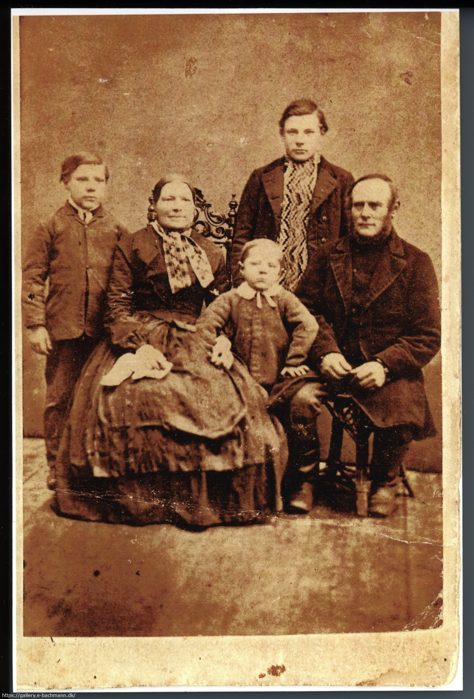
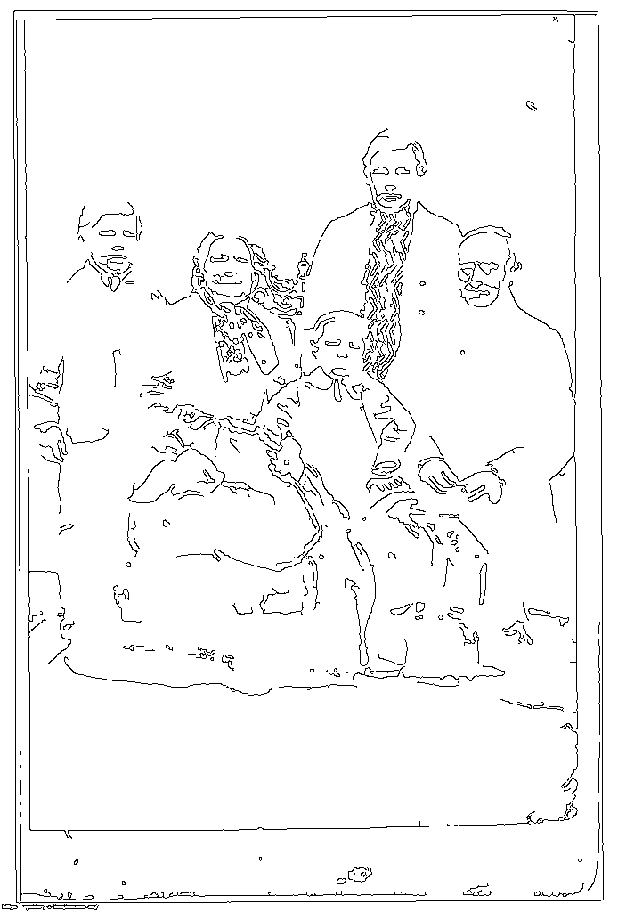
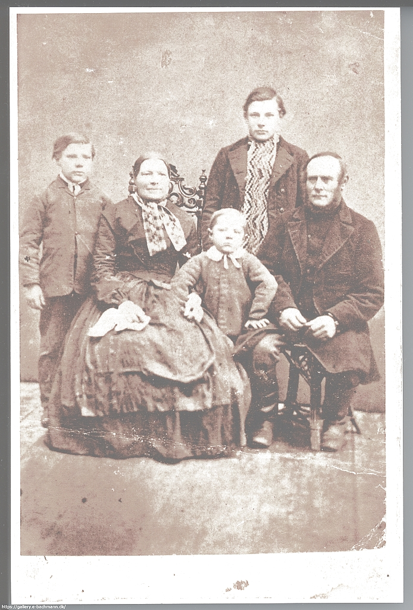

# ImageMagick
Scripts and snippets for image manipulation

<fieldset>
  <legend><b>Warning on congruent names</b></legend>
  ImageMagick has a utillity named <code>convert.exe</code> and so does Windows!
  
  The Windows <a href="https://en.wikipedia.org/wiki/Convert_(command)">convert</a> is used to convert volumes using the FAT file systems to NTFS. Do <i>not</i> try that!
</fieldset>

## Set path to ImageMagick

Run these commands at Windows command line or in a batch job BEFORE calling *ImageMagick*
```console
:: Set %ImageMagic to the path to your local installation of ImageMagick
SET ImageMagick=C:\bin\ImageMagick.portable\
:: Insert path to ImageMagick BEFORE anything else in PATH!
SET PATH=%ImageMagick%;%PATH%
```console

Chech the order of call using the command: `where where`
which will return something like:

```console
C:\bin\ImageMagick.portable\convert.exe
C:\Windows\System32\convert.exe
```

## Examples

Original: 




## Creating silhuettes copy

```console
SET input="I1290a.jpg"
SET output="I1290a.silhuette.jpg"
:: Resize copy to 1024x1024, sharpen edges, auto level+gamma, draw silhuette and set to black on white
SET CONV= -resize 1024x1024 ^
 -sharpen 0x5 ^
 -auto-level ^
 -auto-gamma ^
 -negate ^
 -canny 0x1+10%+30%^
 -negate 
 
"%ImageMagick%convert.exe" %input% %CONV% %output%
```


## Creating lightend copy

```console
SET input="I1290a.jpg"
SET output="I1290a.light.jpg"
:: Resize copy to 1024x1024, sharpen edges, auto level+gamma, lighten
SET CONV= -resize 1024x1024 ^
 -sharpen 1x2 ^
 -auto-level ^
 -auto-gamma ^
 -modulate 150 ^
 
"%ImageMagick%convert.exe" %input% %CONV% %output%
```

